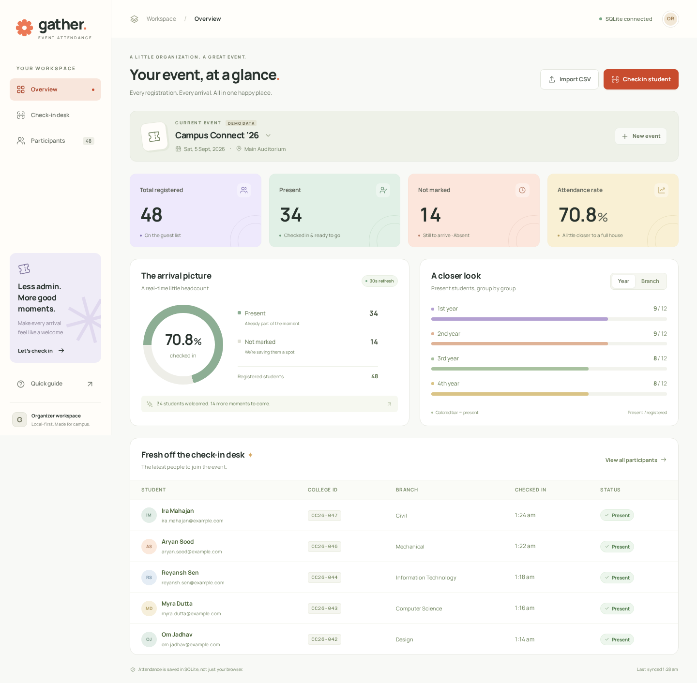

# Gather — Event Attendance Tracker

**A colorful, uncomplicated workspace for campus events.** Register students, verify their College ID at the entrance, mark attendance, and see who has arrived.

Built with **Python + Flask + SQLite + vanilla JavaScript**. No Node.js, frontend build step, external database server, paid service, or API key is required.



## Quick start

### Requirements

- **Python 3.10 or newer**, with `pip` and `venv`.
- A recent Chrome, Edge, Firefox, or Safari browser.
- Internet access for the **first dependency installation only**. Fonts, icons, styles, and JavaScript are bundled locally. The application then works without internet while its local server is running.

### Windows — easiest option

1. Extract the ZIP completely; do not run files inside the compressed folder.
2. Install Python from [python.org](https://www.python.org/downloads/) if needed. Select **Add python.exe to PATH** during installation.
3. Double-click **`run.bat`** inside the extracted project folder.
4. Open **http://localhost:8000** in your browser.
5. Keep the terminal window open while using Gather. Press **Ctrl+C** to stop it.

### macOS / Linux — easiest option

Open a terminal in the extracted project folder:

```bash
bash run.sh
```

Then visit **http://localhost:8000**. On Debian/Ubuntu, if `venv` is missing, install it with `sudo apt install python3-venv`.

### Manual setup (alternative)

Windows PowerShell:

```powershell
py -3 -m venv .venv
.\.venv\Scripts\python.exe -m pip install -r requirements.txt
.\.venv\Scripts\python.exe app.py
```

macOS / Linux:

```bash
python3 -m venv .venv
.venv/bin/python -m pip install -r requirements.txt
.venv/bin/python app.py
```

**Do not open `templates/index.html` directly.** Flask must serve the app because the interface reads and writes a real SQLite database.

## Try it in two minutes

1. The first run creates **Campus Connect '26**, a clearly labeled demo event with **48 fictional registrations**, **34 present**, and **14 not marked**.
2. Open **Check-in desk**. Search for **Diya Patel**, **diya.patel@example.com**, **CC26-003**, or the synthetic phone **0000001003**.
3. Open her registration, compare the displayed College ID with the physical card, and click **Mark as present**.
4. Refresh the browser. Search again: attendance is still **Present**.
5. Try an unknown College ID such as **NOT-REGISTERED-999**. The app reports **Student not found** and does not change attendance.
6. Click **New event** to create a clean event. Import `samples/sample-registrations.csv` or add a student manually.
7. In **Participants**, filter to **Present** or **Not marked / absent**, then **Export CSV**.

Demo names and emails are fictional; emails use `example.com`. Demo phone numbers are intentionally non-dialable placeholders. **Do not use this demo list as real registration data.**

## Features

### Registration and participant directory

- Required: **name, College ID, email**.
- Optional: **phone, year, branch / department**.
- Manual add, edit, and confirmed deletion.
- CSV upload and drag-and-drop with a preview, row-level errors, and a downloadable template.
- Search by **name, email, College ID, or phone**.
- Attendance, year, and branch filters; sorting; pagination.
- Names do not have to be unique. College IDs and emails must be unique **within the selected event**.

### Entrance check-in

- Search, choose a registration, and inspect full details in the participant drawer.
- A clear prompt to verify the physical College ID card before marking present.
- **Present** / **Not marked** status and check-in timestamp.
- Explicit check-in: searching alone never changes attendance.
- Safe repeated check-ins: no double counting; the first timestamp is retained.
- Confirmed **Undo check-in** for mistakes.
- Unknown students cannot be marked present.

### Dashboard and reports

- Total registered, present, not marked / absent, and attendance percentage.
- Attendance donut and year-wise / branch-wise breakdowns.
- Recent arrivals.
- Counts refresh after changes and every 30 seconds when the page is visible and no dialog is open.
- UTF-8 CSV export, including attendance status and UTC check-in time. Exports respect directory filters but include **all matching rows**, not only the current page.

### Usability

- Lilac, mint, peach, and warm-yellow palette; responsive desktop and mobile layouts.
- Self-hosted Manrope font and local inline SVG icons.
- Keyboard-accessible dialogs, labeled controls, focus indicators, textual status badges, and reduced-motion support.
- **Ctrl+K / Cmd+K** opens check-in search. **/** focuses search. **Esc** closes an idle dialog.

## CSV format

```csv
name,college_id,email,phone,year,branch
Alex Morgan,NEW-001,alex.morgan@example.com,,1,Computer Science
Sam Taylor,NEW-002,sam.taylor@example.com,0000000123,2,Design
```

- Use a **comma-separated, UTF-8 `.csv`** file. Excel: **Save As → CSV UTF-8**.
- Required headers: `name`, `college_id`, `email`. Common alternatives such as `Full Name`, `College ID`, and `Email ID` are accepted.
- Optional headers: `phone`, `year`, `branch`. Unknown columns are ignored.
- Years: blank, `1`, `2`, `3`, `4`, `5`, `PG`, or `Other`. Labels such as `1st year` and `Postgraduate` are also recognized.
- College IDs: 2–32 characters; letters, numbers, `.`, `_`, `/`, and `-`; first character must be a letter or number. Whitespace is trimmed and IDs are stored uppercase.
- Email addresses are trimmed, lowercased, and checked for basic format. This does not verify mailbox ownership.
- Optional phone numbers: 7–15 digits; common punctuation is accepted and removed before storage/search.
- Commas inside values must be quoted. Blank rows are ignored.
- Maximum request size: **2 MB**, including upload overhead. Maximum **5,000 participants** per import.
- **All-or-nothing import:** any invalid row or duplicate blocks the entire file. Existing data is never overwritten. The final import revalidates the preview and is committed in one database transaction.
- CSV imports **never mark attendance**. Extra `attendance`, `present`, or timestamp columns are ignored.
- The supplied template and sample file use different IDs from the built-in demo. Re-importing either into the same event is correctly rejected as a duplicate.

## Data storage and persistence

The application creates **`data/attendance.sqlite3`** on first launch. Attendance is stored server-side, not in JavaScript memory or browser storage.

- Refreshing, closing the browser, or restarting the server preserves data.
- The same student may attend multiple events; attendance is independent for each event.
- Browser `localStorage` stores **only the selected event ID**, not attendance.
- **Not marked** and **Absent** are treated as the same reporting state. There is no separate “explicitly absent” state.
- An undo clears the check-in timestamp but keeps the registration.
- Deleting a registration also deletes its attendance for that event; confirmation is required.
- This version does not keep an attendance audit history or organizer identity.

### Backup

Stop every Gather process, then copy the **entire `data/` folder** to a safe location, including any SQLite companion files. Restore only while Gather is stopped. See [data/README.md](data/README.md).

CSV is a **report**, not a complete database backup: it does not preserve database IDs, all events, or imported attendance. Some exported text is prefixed with an apostrophe to prevent spreadsheet formula execution.

## Configuration (optional)

| Environment variable | Default | Purpose |
|---|---|---|
| `PORT` | `8000` | HTTP port |
| `HOST` | `127.0.0.1` | Bind address; local machine only by default |
| `ATTENDANCE_DB` | `data/attendance.sqlite3` under the project | SQLite database path; an absolute path is recommended for custom storage |
| `SEED_DEMO` | `1` | `0` disables demo seeding **for a new database**; existing data is not removed |

Example: run an empty workspace on a different port.

macOS / Linux:

```bash
SEED_DEMO=0 ATTENDANCE_DB="$PWD/data/my-events.sqlite3" PORT=8001 .venv/bin/python app.py
```

Windows PowerShell:

```powershell
$env:SEED_DEMO = "0"
$env:ATTENDANCE_DB = "$PWD\data\my-events.sqlite3"
$env:PORT = "8001"
.\.venv\Scripts\python.exe app.py
```

There is no `.env` loader. Set variables in the shell as shown above.

For a **trusted-network demonstration only**, set `HOST=0.0.0.0`. Devices must connect to that server's address, not their own `localhost`. Browser API URLs are relative, so reverse-proxied demos work without editing frontend code.

## Project structure

```text
event-attendance-tracker/
├── app.py                     Flask application factory, routes, API and exports
├── database.py                Per-request SQLite connection and initialization
├── validation.py              Shared registration, event and CSV validation
├── seed.py                    Fictional first-run demo data
├── schema.sql                 Tables, constraints and indexes
├── requirements.txt           Runtime dependency
├── requirements-dev.txt       Optional browser-test dependency
├── run.bat / run.sh            Convenient launch scripts
├── templates/index.html       Accessible page and dialog structure
├── static/
│   ├── css/styles.css         Theme, components and responsive layouts
│   ├── js/app.js              UI state, API calls, forms and render functions
│   ├── fonts/                 Bundled Manrope font + SIL license
│   └── favicon.svg
├── data/                      Runtime database (not included in Git/ZIP)
├── samples/                   CSV template and six sample registrations
├── tests/
│   ├── test_app.py            40 isolated database/API tests
│   └── browser_smoke.py       Optional end-to-end browser checks
└── docs/
    ├── ARCHITECTURE.md        Design decisions and explanation guide
    ├── TESTING.md             Test coverage and manual demo checklist
    ├── dashboard.png          Actual application screenshot
    └── demo.webm              Short, silent screen recording
```

## Tests

From the project directory, using the same Python environment used to run the app:

```bash
python -m unittest discover -s tests -v
```

If your virtual environment is not activated, replace `python` with `.venv/bin/python` on macOS/Linux or `.\.venv\Scripts\python.exe` on Windows. The tests use temporary databases and **do not touch your saved attendance**.

Optional browser test:

```bash
python -m pip install -r requirements-dev.txt
python -m playwright install chromium
python tests/browser_smoke.py
```

Linux CI may need `python -m playwright install --with-deps chromium`. See [docs/TESTING.md](docs/TESTING.md).

## Design choices, assumptions and limits

- **Flask** keeps the server small and easy to follow. **SQLite** provides durable storage and transactions without a database server. **Plain JavaScript** keeps the UI build-free. [Full explanation →](docs/ARCHITECTURE.md)
- This is a **single-workspace coursework/local demonstration app**, not a production system. **There is no login, authorization, organizer audit trail, or public-user signup. Anyone who can access the server can view and modify registrations.**
- Use fictional data in any public preview. Before using real student data over a network, add authentication, authorization, HTTPS, a production WSGI server, privacy controls, and a backup policy.
- Multiple browsers connected to **the same server/database** share attendance. Separate downloaded copies are independent. There is no cloud sync or offline write queue.
- SQLite suits a small event and modest concurrent usage. This is not designed for thousands of simultaneous entrance scans.
- A College ID's formatting and membership in the selected event are checked. The application **does not query an official college registry or authenticate a physical card**. That is the organizer's responsibility.
- Phones are optional and not required to be unique. Partial searches may return multiple students; the organizer chooses the correct record.
- Names support Unicode text; SQLite's built-in case-insensitive search/collation is primarily ASCII. Branch grouping uses the exact saved branch text, so consistent branch names are recommended.
- Event dates are organizational metadata, not access restrictions. There is no date-based check-in lock or time-window enforcement.
- Check-ins use server UTC time; the UI displays the browser's local timezone. CSV timestamps are explicitly UTC.
- Demo seeding happens only in a new/empty workspace, not on every restart.

## Demo and submission

- Open **`docs/demo.webm`** in a browser or video player for the included screen recording.
- Run the app locally to give an interactive demonstration. The live preview supplied with this project is temporary, not a permanent deployment URL.
- This ZIP is a complete source-code deliverable. To submit a GitHub link, create your own repository, commit the extracted source, and push it. The provided `.gitignore` excludes private attendance databases and the virtual environment.
- Before presenting, read [ARCHITECTURE.md](docs/ARCHITECTURE.md), run the tests, and practice the demo. Follow your institution's AI-assistance policy and be prepared to explain and modify the code you submit.

## Troubleshooting

| Problem | Fix |
|---|---|
| “Python was not found” | Install Python 3.10+, enable PATH, reopen the terminal. On Windows the `py -3` launcher also works. |
| `No module named flask` | Install `requirements.txt` with the same interpreter used to run `app.py`. The launch scripts do this automatically. |
| `venv` unavailable on Linux | Install the distribution's `python3-venv` package. |
| Port 8000 is already used | Stop the previous Gather process or set `PORT=8001`. Do not repeatedly start duplicate servers. |
| Blank page from a local HTML file | Start Flask and visit `http://localhost:8000` instead. |
| “Connection interrupted” | Keep the server running. Check its terminal log, then click **Try again**. Saved data is not erased. |
| CSV rejected | Use UTF-8 comma-separated CSV, required columns, unique IDs/emails, and the row errors shown in the preview. |
| Duplicate students when importing | Edit the existing registration, remove duplicates from the CSV, or import into a different event. |
| Need a blank event | Click **New event**. You do not need to delete the demo database. |
| Data seems missing | Check the selected event and the `ATTENDANCE_DB` path. Run from the same project installation. |
| Can't see another organizer's check-in | Confirm both browsers use the same server and selected event. Close open dialogs and wait up to 30 seconds or refresh. |
| Hosted server loses data after redeployment | SQLite requires persistent disk storage. An ephemeral host filesystem is not a durable deployment solution. |

## License

Project code: MIT. Bundled Manrope font: SIL Open Font License, included in `static/fonts/OFL.txt`.
